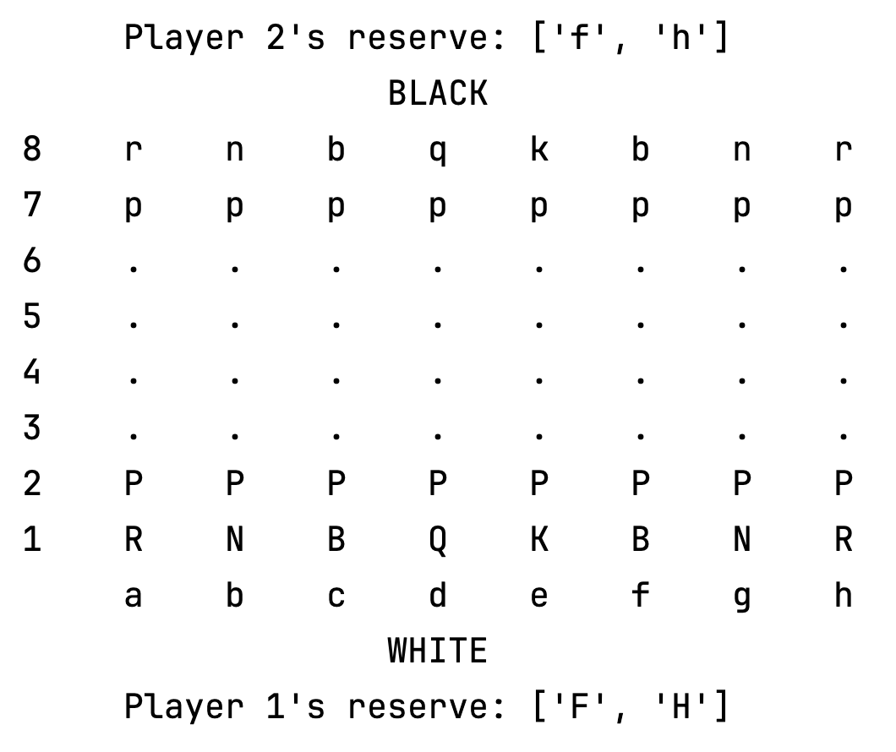

# ChessVar Project

## Description
The ChessVar project is a collection of classes designed for playing an abstract board game that is a variant of chess. The core class, **ChessVar**, handles the main game logic, while other classes provide additional functionality such as 
piece movement and game state management. All classes and a standalone main function for game play are contained within the **ChessVar.py** file. There are separate testing files for each class.

## Table of Contents
- [Description](#Description)
- [Installation](#Installation)
- [Rules](#Rules)
- [Game Board](#Game-Board)
- [Special Pieces](#Special-Fairy-Pieces)
- [Game Play](#Game-Play)
- [Classes Overview](#Classes-Overview)
- [Acknowledgements](#Acknowledgements)

## Installation
Download **ChessVar.py** and execute within a Python environment to start playing.

## Rules
The following explanation of the rules assumes some familiarity with the rules of chess — specifically how the pieces move 
and capture. The starting position for the game is the normal starting position for standard chess. As in standard chess, 
white moves first. Pieces move and capture the same as in standard chess, except that there is no check or checkmate, 
and there is no castling, en passant, or pawn promotion. As in standard chess, each pawn should be able to move two spaces 
forward on its first move (but not on subsequent moves). If a player's king is captured, the game ends, and that player loses. 
Locations on the board will be specified using "algebraic notation", with columns labeled a-h and rows labeled 1-8, as shown 
under [Game Board](#Game-Board).

## Game Board

  
  

The game board (right) is designed to replicate a standard chessboard layout (left). In this representation, lowercase letters denote 
black pieces, while uppercase letters represent white pieces.

## Special Fairy Pieces
For this variant of chess:
Each of the players has one piece of the **Falcon** and the **Hunter** in their reserve.

Falcon: moves forward like a bishop, and backward like a rook

Hunter: moves forward like a rook and backward like a bishop

The falcon and hunter start the game off the board. Once a player loses their queen, a rook, a bishop, or a knight, they may, on any subsequent move, enter their falcon or hunter into play on any **empty square of their two home ranks**. Doing so constitutes a turn. The player becomes eligible to enter their remaining fairy piece (falcon or hunter) after losing a second piece (queen, rook, bishop, or knight). This could be anytime after losing the first piece, and doesn't need to be losing after entering the first fairy piece.

## Game Play

**Chess Piece Abbreviations**   

| Piece   | Black / White | 
|---------|---------------|
| Bishop  | b / B         |
| Knight  | n / N         |
| Rook    | r / R         |
| Queen   | q / Q         |
| King    | k / K         |
| Pawn    | p / P         |
| Fairy   | f / F         |
| Hunter  | h / H         |

**How to Enter Moves**

You must enter moves in a specific format: **start_coordinate/end_coordinate/fairy_piece**

| Move                  | Format  | Description |
|-----------------------|---------|-------------|
| Regular move          | d2/e3/x | Moves piece from d2 to e3 |
| Fairy piece placement | d1/x/F  | Places Falcon on d1 |
| End game              | END/x/x | Automatically ends game |

For **Fairy piece placement**, check your reserve to ensure you are placing the correct piece.

## Classes Overview

**Player:** A class representing a chess player. This class keeps track of a player's fairy pieces (falcon and hunter).

**Pieces:** A static class representing chess pieces. This class has static methods that determine if a chess move by any chess piece is valid.
Each method checks the validity of moves based on the specific movement rules of each piece.

**Board:** A class representing a chess board. This class has methods for placing, removing, and retrieving chess pieces on a board.

**ChessVar:** A class representing one round of a chess-variation game. This class has methods to determine game state, player turns, and execute player moves.

### Acknowledgements
This project is adapted from my final project for Oregon State University's CS162. 